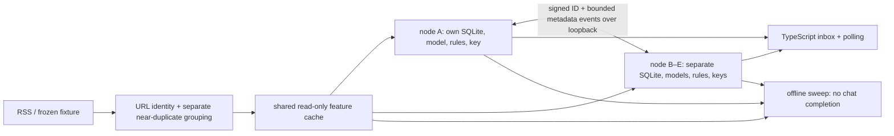

# Plan 001 — Membrane Agent POC

Status: **APPROVED 2026-10-07** – plan ratified after defaults accepted.

## 1. Shape and scope

Five independently launched Python processes, each bound to loopback and each owning one SQLite database and Ed25519 keypair. One TypeScript web app connects to a selected node's loopback API; a node switcher selects among the five without merging their state. Each node imports the same frozen RSS fixture and may separately ingest the one live RSS feed. A fixture builder snapshots feed entries across a capture window, quotas sources, and pins the output hash; third-party snippets and derived feature caches remain uncommitted. A local model2vec encoder precomputes embeddings once; nodes read the same read-only cache but keep labels, rules, models, scores, votes, polls, and peer weights in their *own* stores. The fixture cannot contain five human labels until five people actually provide them; fake labels must never be reported as experimental evidence.

All item text stays on its ingesting node or in a local fixture shared by the five demo processes. The cross-node **event** transport never carries titles, URLs, bodies, summaries, embeddings, scores, or rationale. The shared fixture is a demo assumption, not a peer-sync feature. A node without the polled item reports `unknown_item` and emits no vote; it never fetches item content from a peer. A truncated SHA-256 URL digest is *not anonymous*: someone who guesses a URL can compute and match its ID. The privacy promise is no plaintext content in events, not secrecy of known browsing URLs from trusted peers; the initial POC must not ingest private IMAP content.

## 2. Decision gates requiring correction or approval
## 2. Decision gates (resolved 2026-10-07: proposed decisions accepted)
| Gate | Conflict or unknown | Proposed decision for review |
|---|---|---|
| P1: signed wire | Constitution I limits the entire inter-node payload to `(item_id, vote, confidence, ts, sig)` while FR-8 requires per-member author identity and vector-clock ordering, and FR-11 needs a poll invitation. These cannot all be true simultaneously. | Amend Article I to permit only bounded protocol metadata (`version`, `kind`, `author_id`, `seq`, `poll_id`), never content; use Ed25519 and a per-author monotonic sequence instead of a vector clock. Draft contract below. Do **not** fake polls as special abstain votes. |
| P2: peers versus verdict | Article III prohibits peers from changing the verdict class, yet the spec implies a peer vote can change whether content gets through the membrane. | Keep Article III for the POC: peers reorder **within** `allow`, `digest`, or `block`, and show an advisory poll card. Update the value claim and metric: peer benefit is ranking/attention budget, not binary reclassification. Change Article III only if user explicitly chooses peer promotion across classes. |
| P3: evidence | AC-4 currently requires solo+peer to outperform solo, which cannot be guaranteed by design; §9's “5-member majority oracle” includes the target user's label. | Report a signed delta and CI even when negative; use the other **four** peers for a leave-one-out reference, with ties declared. No acceptance criterion may require a favorable empirical result. |
| P4: fixture | One pass returned 250 items (72% one source), Substack 403, zero real duplicate pairs; summary lengths p10/50/90 = 94/151/272 chars. | Accumulate daily with item-ID dedup, cap each source, drop/replace the 403 feed; evaluate duplicate matching on a separately hand-labeled positive/negative pair set. Restrict manipulation claims to title/lede unless body licensing is resolved. |
| P5: human labels | Five distinct raters and later blind relabels cannot be generated by code. | Permit five demonstration personas with clearly *synthetic* votes for the round-trip demo; reserve accuracy and conformity claims for human-collected labels. If no five humans are available, report the experiment as **not run**, not simulated as evidence. |
| P6: Ollama | User originally selected “Ollama only”; the draft changed D3 to optional Ollama without an explicit user ratification. | Keep local-only corpus inference; ask whether on-demand generation is a required POC feature. If yes, install a small CPU-feasible Ollama model and verify UX latency; if no, show deterministic reason codes, never fake an LLM summary. |
| P7: publication boundary | Articles I/V are compatible with local stores, but the old Article V check “stopping A leaves B's inbox byte-identical” contradicts intentional vote propagation. | Replace with “A has no write access to B's SQLite; after stopping A, B's state changes only upon its own ingest/user action or processing an already received signed event.” |

The recommended defaults for Q1–Q9 are **proposals**, not ratification. In particular Q4 (title/lede vs licensed full bodies) and Q5 (availability of five raters) affect what the POC can honestly claim.

## 3. Components and contracts

| Component | Owner and interface | Invariant |
|---|---|---|
| Fixture/live adapter | Python `ingest()` yields normalized item metadata; separate snapshot builder; see `contracts/classifier.md` | Live fetch disabled during eval; source quota applies before labeling |
| Identity | Existing pure `identity.py`: `item_id(url)` = first 16 hex of SHA-256 normalized URL; content SimHash = grouping **hint** | Across-node IDs agree for same URL; a near-duplicate *group representative* can change as new members arrive and must not become the signed vote ID without an explicit migration |
| Features | Read-only shared **fixture** cache keyed by `(item_id, model_version, text_hash)`; each node's live-item cache is private. Model2vec `potion-base-8M` plus deterministic title/lede features | Never write live content into the shared cache or reuse a stale embedding after text changes; no chat completion during eval |
| Node store | One SQLite DB per process with WAL and transactions; see `data-model.md` | Node A has no connection/path to B's DB; migrations versioned |
| Local scorer | Logistic model per user, fit only on their training labels; title/lede manipulation rules separately versioned | Two scores stored separately; no training on held-out labels; explicit `insufficient_labels` state |
| Gate | Hard allow/block rules → independent preference/manipulation thresholds → immutable verdict class → peer-assisted order inside class | Every item has reason codes; peer event cannot override a hard rule or verdict class |
| Identity/trust | Ed25519 pubkeys pinned manually in five local configs; local revocation; track record on prior locally labeled training items | No transitive trust; no automatic key discovery; no gain for constant-vote peer |
| Events/polls | Strict signed JSON event contract in `contracts/vote-log.schema.json`; localhost POST, explicit receiver acknowledgment; see `contracts/exchange.md` | Strict schema, size/rate bounds, replay idempotence, author verified against pinned roster |
| UI | TypeScript client of the Python loopback JSON API | Suppressed items queryable; peer result labeled “your circle's take”; unknown poll item shown as unavailable, not silently omitted |
| Eval | Frozen fixture and features, per-user time split, cluster bootstrap by duplicate group; report all prespecified arms | Rerun from same snapshot/seed yields byte-identical report; negative result retained |

The existing `tools/capture.py` is a one-shot capture, **not** the described accumulating/quota-controlled builder. Its 250-item output is exploratory, not the frozen evaluation fixture. The existing identity module groups close SimHashes transitively (A≈B≈C does not imply A≈C): the false-merge rate must be measured on a labeled pair set; do not assume 90% accuracy from the 29 passing unit cases.

## 4. Gate and peer math (review proposal, not an implementation decision)

Hard rules win in explicit priority: block > allow for conflicting rules, then the first matched rule within a priority tier in user-defined order; the UI must expose the conflict. Without a hard rule, tentative thresholds are: block if `manipulation >= 0.8` or `preference < 0.3`; allow if `preference >= 0.7` and `manipulation < 0.6`; otherwise digest. Cold start routes to digest rather than inventing a confident preference. Class threshold behavior is evaluated separately from within-class ordering.

For a peer with prior *locally labeled* examples, estimate sensitivity `TPR` and false-positive rate `FPR` with symmetric pseudocounts of 2, but require at least 3 positive **and** 3 negative examples before granting influence. A peer whose votes have only one distinct non-abstaining value has `w = 0` regardless of smoothing. Otherwise define `J = max(0, TPR − FPR)` (Youden informedness) and proposed weight `w = min(0.25, 0.25 × J × 2^(−idle_days/30))`; no trust on held-out labels, no transitive weighting, no weight after revocation. At a frozen evaluation cutoff, compute weights only from earlier training items. A single peer's contribution to a rank adjustment is bounded by 0.25, not necessarily its power over a rank *position*: a tiny change can swap two adjacent items. Never claim a “≤25% of inbox moves” bound. Default within-class rank = local preference score plus the sum of `w × direction × confidence_bp/10000` over each peer's latest valid vote; keep and kill use direction ±1, abstain 0. Rank adjustment is derived transiently; the two scoring axes remain separately persisted.

Polls are invitations for an existing item ID, not truth votes. A peer responds only if it has ingested that exact ID. Votes carry an optional `poll_id`; the recipient aggregates only matching, verified responses and renders the count, missing peers, and its **own** weighted view. No “consensus node” replicated to others. Votes may also exist outside polls; the log has an explicit event type rather than overloading `abstain`.

## 5. Offline evaluation and honest limits

- Construct a frozen, checksum-pinned corpus with per-source caps and a time split; exclude duplicate *groups* across train/test. If licensed full text is unavailable, score title/lede only and label the threat claim accordingly.
- Five people label without peer visibility; reserve a later subset for randomized peer-visibility and blind relabel after the agreed gap. Randomize **within participant** over items; analysis clusters by duplicate group and participant. Later self-label is a stability proxy, not objective truth. If participants are unavailable, do not emit user-study effects from persona data.
- For each user, train a preference model and peer weights only on that user's earlier labels and the peers' earlier votes. Evaluate on held-out labels before allowing those labels to update any weight. The majority comparator excludes the user's label; ties among four are reported as ties, not silently resolved.
- Compare heuristic, solo, solo+peer ordering, solo+peer ordering+manipulation gate, and random at a fixed attention budget; report allow/digest/block classification separately. Bootstrap the **paired** per-item delta, grouped by near-duplicate family, with a fixed seed and versioned labels/feature cache.
- Poisoning sensitivity: inject one properly signed malicious member in the five-node sandbox, compare capped vs uncapped **within-class top-K exposure and rank movement**; under proposed Article III, peer votes cannot alter `allow/digest/block`, so a peer-caused false-block-rate change must be exactly zero. Show actual measured exposure damage, not an assumed percentage bound. Neither signature nor weight cap proves defense against coordinated trusted peers, and no raw threshold guarantees favorable accuracy.

## 6. Execution and review gate

Planning artifacts: this plan, `data-model.md`, and three files under `contracts/`. These specify a proposed architecture and contract **only**; `tasks.md` belongs to the next phase and is intentionally absent. No new runtime module, migration, UI, fixture labels, or eval harness should be written in this phase. Reviewer to attack contradictions before any spec amendments or implementation. Approval must cover P1–P7, Q1–Q9, the proposed wire amendment, and the changed evaluation claim. After corrections and explicit go-ahead: amend/ratify spec and constitution as needed, then write tasks and implement.
